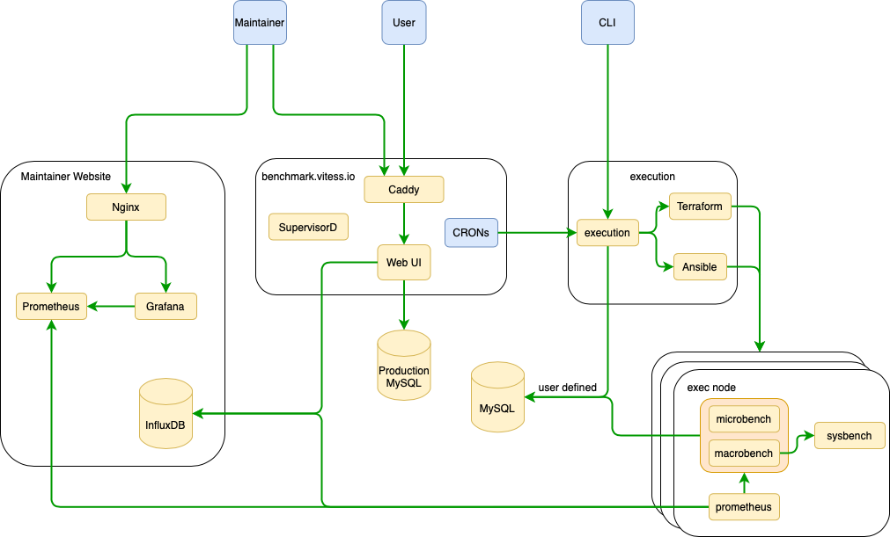

# [AreWeFastYet](https://benchmark.vitess.io)
Uses sysbench to run a benchmark on vitess. 
The following codebase:
1. Creates a VPS
2. Runs the ansibles on the VPS
3. reads results from the VPS and stores in the database
4. Kills the VPS

## [Docs](docs/README.md)

## Architecture

